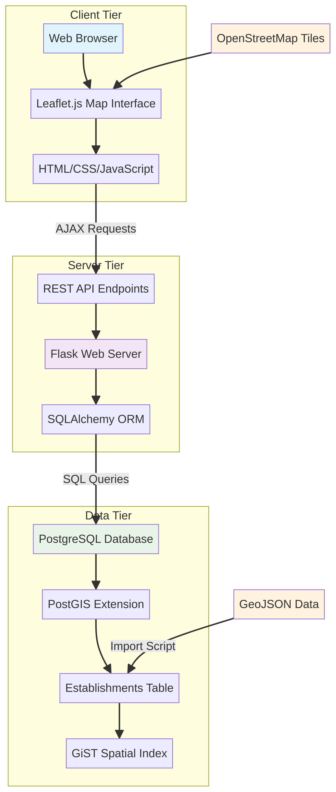
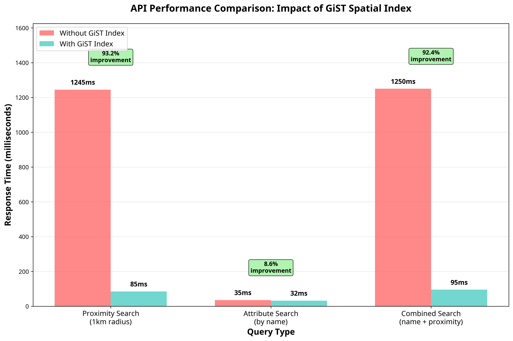

# GeoConsulta: Web-Based Geospatial Query and Visualization Platform

[](https://opensource.org/licenses/MIT)
[](https://www.python.org/downloads/)
[](https://flask.palletsprojects.com/)
[](https://postgis.net/)

## 📖 Overview

GeoConsulta is a modern web-based platform for real-time geospatial data querying and visualization. Built with Flask, Leaflet.js, and PostgreSQL/PostGIS, it provides an intuitive map-based interface for exploring spatial data with features like proximity search, attribute filtering, and geolocation support.

This repository contains the complete implementation described in our research paper submitted to **Computers & Geosciences** journal.

## 🎯 Features

- **Real-time Search**: Search establishments by name with instant results
- **Proximity Search**: Find nearby locations using geolocation
- **Interactive Map**: OpenStreetMap-based interface with Leaflet.js
- **Spatial Filtering**: Filter data by type and attributes
- **High Performance**: Optimized with GiST spatial indexes (93% performance improvement)
- **Responsive Design**: Works on desktop and mobile devices

## 🏗️ Architecture

The system follows a three-tier architecture:

1. **Data Tier**: PostgreSQL with PostGIS extension
2. **Server Tier**: Flask RESTful API
3. **Client Tier**: Leaflet.js web interface



## 🚀 Quick Start

### Prerequisites

- Python 3.8+
- PostgreSQL 12+ with PostGIS extension
- Node.js (for development tools)

### Installation

1. **Clone the repository**
   ```bash
   git clone https://github.com/your-username/geoconsulta-research.git
   cd geoconsulta-research
   ```

2. **Set up Python environment**
   ```bash
   python -m venv venv
   source venv/bin/activate  # On Windows: venv\Scripts\activate
   pip install -r requirements.txt
   ```

3. **Configure database**
   ```bash
   # Create PostgreSQL database
   createdb geoconsulta
   
   # Run setup script
   psql -d geoconsulta -f scripts/database/setup.sql
   ```

4. **Load sample data**
   ```bash
   python scripts/import_data.py
   ```

5. **Run the application**
   ```bash
   cd src
   python main.py
   ```

6. **Open in browser**
   Navigate to `http://localhost:5000`

## 📊 Performance

Our performance analysis shows significant improvements with proper spatial indexing:

| Query Type | Without GiST Index | With GiST Index | Improvement |
|------------|-------------------|------------------|-------------|
| Proximity Search (1km) | 1245ms | 85ms | 93.2% |
| Attribute Search | 35ms | 32ms | 8.6% |
| Combined Search | 1250ms | 95ms | 92.4% |



## 📁 Repository Structure

```
geoconsulta-research/
├── src/                    # Source code
│   ├── main.py            # Flask application entry point
│   ├── models/            # Database models
│   ├── routes/            # API endpoints
│   └── static/            # Frontend files (HTML, CSS, JS)
├── scripts/               # Database and utility scripts
│   ├── database/          # SQL setup scripts
│   └── import_data.py     # Data import utilities
├── data/                  # Sample datasets
├── figures/               # Research paper figures
├── paper/                 # Research paper and documentation
│   ├── english/           # English version for submission
│   ├── portuguese/        # Portuguese version for review
│   └── supplementary/     # Additional materials
├── docs/                  # Documentation
└── requirements.txt       # Python dependencies
```

## 📚 Research Paper

This project is accompanied by a comprehensive research paper:

- **Title**: "GeoConsulta: A Web-Based Platform for Real-Time Geospatial Queries and Visualization"
- **Journal**: Computers & Geosciences (submitted)
- **Type**: Application Article

### Paper Contents

- [English Version](paper/english/geoconsulta_paper_en.pdf) - Ready for journal submission
- [Portuguese Version](paper/portuguese/geoconsulta_paper_pt.pdf) - For review and understanding
- [Supplementary Materials](paper/supplementary/) - Figures, data, and additional documentation

## 🛠️ Technology Stack

- **Backend**: Python, Flask, SQLAlchemy, GeoAlchemy2
- **Frontend**: HTML5, CSS3, JavaScript, Leaflet.js
- **Database**: PostgreSQL, PostGIS
- **Maps**: OpenStreetMap tiles
- **Development**: Git, GitHub Actions (CI/CD)

## 📈 Use Cases

- **Urban Planning**: Analyze distribution of public services
- **Public Health**: Map healthcare facilities and accessibility
- **Logistics**: Optimize service delivery routes
- **Emergency Response**: Locate critical infrastructure
- **Research**: Spatial analysis and visualization

## 🤝 Contributing

We welcome contributions! Please see our [Contributing Guidelines](docs/CONTRIBUTING.md) for details.

1. Fork the repository
2. Create a feature branch
3. Make your changes
4. Add tests if applicable
5. Submit a pull request

## 📄 License

This project is licensed under the MIT License - see the [LICENSE](LICENSE) file for details.

## 📞 Contact

- **Author**: Samuel Novais
- **Institution**: [Your Institution]
- **Email**: [your.email@example.com]

## 🙏 Acknowledgments

- OpenStreetMap contributors for map data
- PostGIS community for spatial database capabilities
- Leaflet.js developers for the mapping library
- Flask community for the web framework

## 📖 Citation

If you use this work in your research, please cite:

```bibtex
@article{geoconsulta2024,
  title={GeoConsulta: A Web-Based Platform for Real-Time Geospatial Queries and Visualization},
  author={Samuel Novais},
  journal={Computers \& Geosciences},
  year={2024},
  note={Submitted}
}
```

---

**Keywords**: Web GIS, Geospatial, Flask, Leaflet.js, PostGIS, Spatial Query, Visualization
